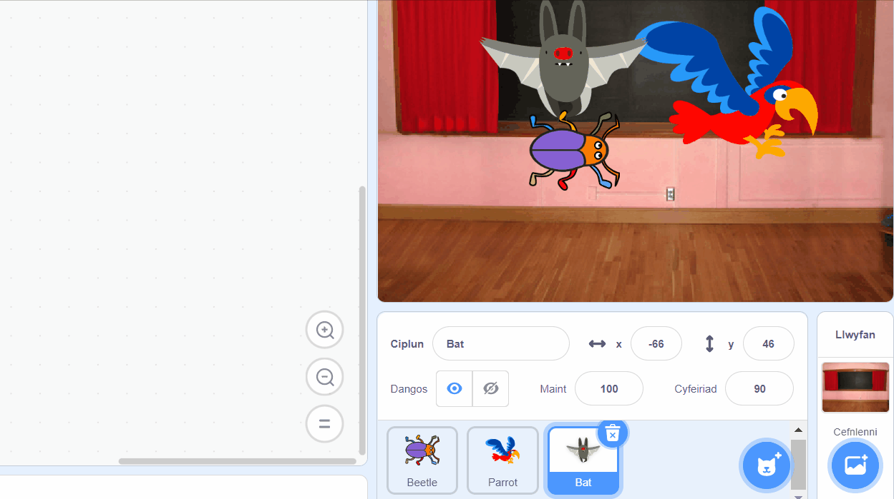

Galli di gopïo cod o un corlun i gorlun arall yn y rhestr Corluniau:

Bydd gan y ddau gorlun y blociau cod rwyt ti wedi'u copïo. Os wyt ti'n symud y cod o un corlun i'r llall, galli di ddileu'r cod o'r corlun cyntaf ar ôl i ti ei gopïo i'r corlun arall.

