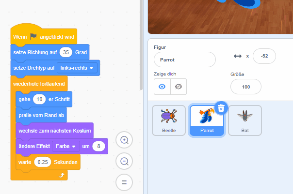

Du kannst Code aus dem Codebereich von einer Figur in eine andere Figur in der Figurenliste ziehen:

Beide Figuren enthalten die Codeblöcke, die du kopiert hast. Wenn du den Code von einer Figur zu einer anderen Figur verschieben möchtest, kannst du den Code aus der ersten Figur löschen, nachdem du ihn in die andere Figur kopiert hast.

