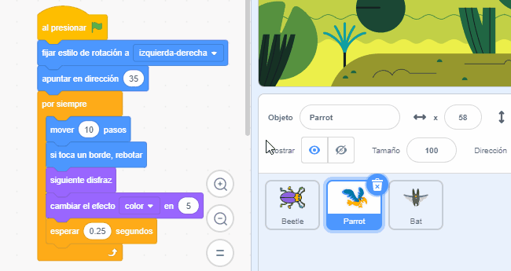

Puedes copiar el código de un objeto a otro objeto en la lista de Objetos:

Ambos objetos tendrán los bloques de código que has copiado. Si estás moviendo el código de un objeto a otro, puedes eliminar el código del primer objeto después de haberlo copiado en el otro objeto.

