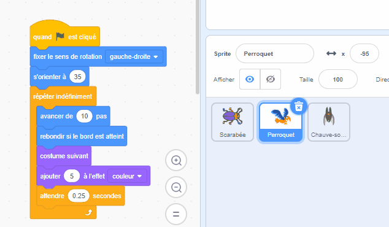

Tu peux copier le code d'un sprite vers un autre sprite dans la liste des sprites :

Les deux sprites auront les blocs de code que tu as copiés. If you are moving the code from one sprite to the other, you can delete the code from the first sprite after you have copied it to the other sprite.

