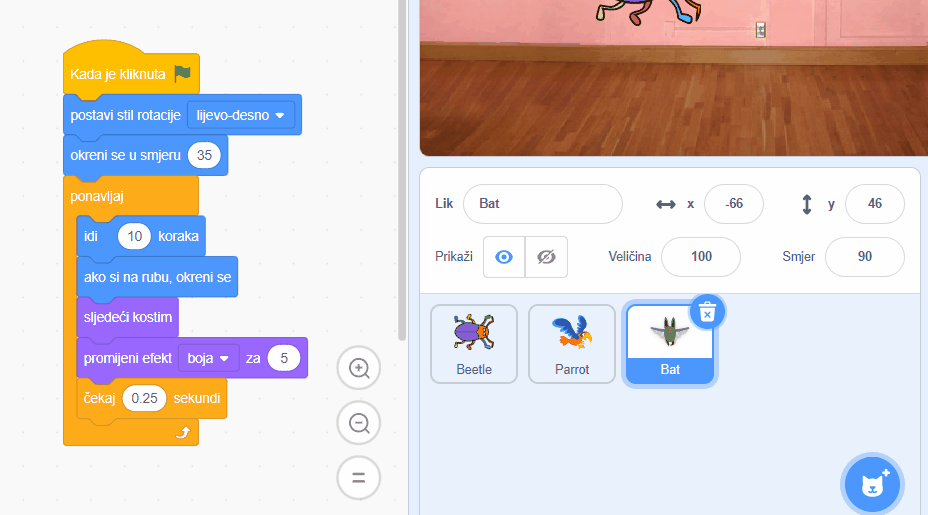

Možeš kopirati kôd s jednog lika na drugi lik koji se nalazi popisu likova:

Oba lika će imati kopirane blokove kôda. Ako premještaš kôd s jednog lika na drugi, možeš izbrisati kôd s prvog lika nakon što ga kopiraš na drugi lik.
