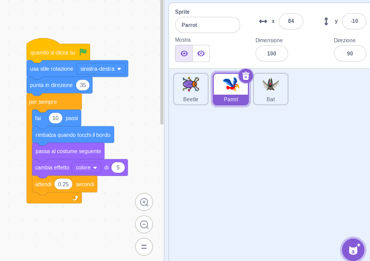

Puoi copiare il codice da uno sprite a un altro sprite nell'elenco sprite:

Entrambi gli sprite avranno i blocchi di codice che hai copiato. Se stai spostando il codice da uno sprite all'altro, puoi eliminare il codice dal primo sprite dopo averlo copiato sull'altro.

