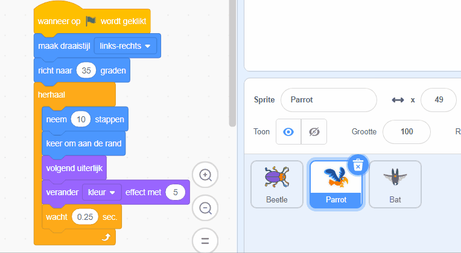

Je kunt code van de ene sprite naar een andere sprite kopiëren in de Sprite-lijst:

Beide sprites hebben de codeblokken die je hebt gekopieerd. Je kunt de code uit de eerste sprite verwijderen als je de code wilt verplaatsen.

