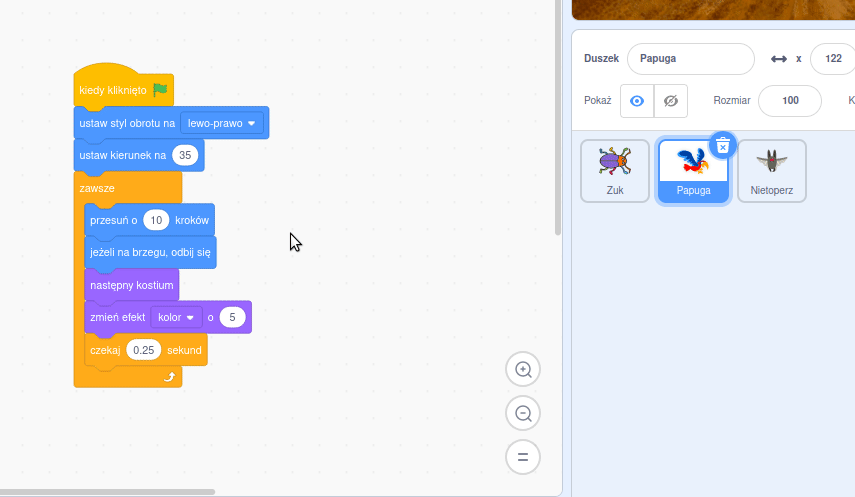

Możesz kopiować kod między duszkami znajdującymi się na liście duszków:

Oba duszki będą miały skopiowane przez Ciebie bloczki kodu. Jeśli przenosisz kod z jednego duszka do drugiego, to możesz usunąć go z pierwszego duszka po skopiowaniu do drugiego.

