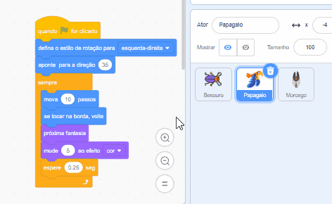

Você pode copiar o código de um ator para outro ator na lista de Atores:

Ambos os atores terão os blocos de código que você copiou. Se você está movendo o código de um ator para outro, você pode deletar o código do primeiro ator depois de copiá-lo para o outro ator.

