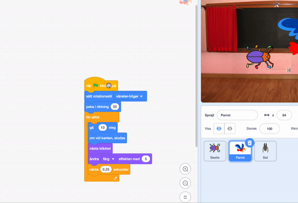

Du kan kopiera kod från en sprajt till en annan i sprajtlistan:

Båda sprajterna kommer att ha kodblocken som du har kopierat. Om du flyttar koden från en sprajt till en annan kan du ta bort koden från den första sprajten efter att du har kopierat den till den andra sprajten.

