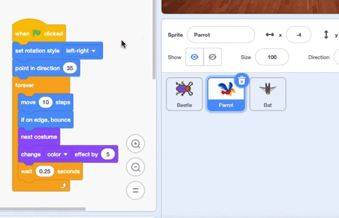

మీరు sprite జాబితాలో ఒక sprite నుండి మరొక sprite కి కోడ్‌ను కాపీ చేయవచ్చు:

రెండు sprite లు మీరు కాపీ చేసిన కోడ్ బ్లాక్‌లను కలిగి ఉంటాయి. మీరు కోడ్‌ను ఒక sprite నుండి మరొకదానికి తరలిస్తుంటే, మీరు దానిని మరొక sprite కు కాపీ చేసిన తర్వాత మొదటి sprite నుండి కోడ్‌ను తొలగించవచ్చు.

