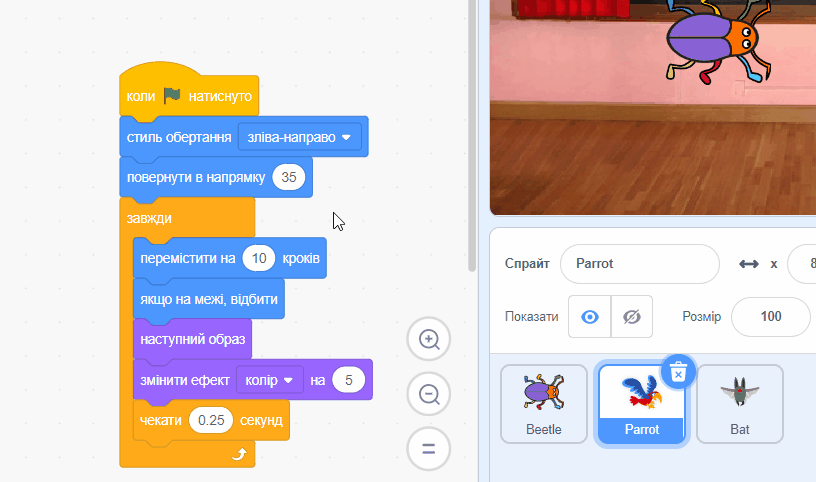

You can copy code from one sprite to another sprite in the Sprite list:

Both sprites will have the code blocks that you have copied. If you are moving the code from one sprite to the other, you can delete the code from the first sprite after you have copied it to the other sprite.

